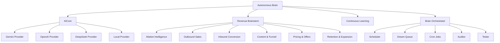

# Autonomous Brain System

A production-ready AI system with autonomous capabilities, revenue generation, continuous learning, and comprehensive monitoring.

## Features

- ✅ **Autonomous AI Core** - Multi-provider routing with fallbacks
- ✅ **Revenue Brainstem** - Closed revenue loop with CRO capabilities
- ✅ **Continuous Learning** - Self-improving AI system
- ✅ **Brain Orchestrator** - Centralized control of all components
- ✅ **System Auditor** - Comprehensive auditing and testing
- ✅ **API Client** - Robust HTTP client with retries
- ✅ **Local Model Support** - Ollama and llama.cpp integration

## Installation

```bash
npm install
```

## Usage

### Development

```bash
# Build the project
npm run build

# Start development server
npm run start:dev

# Run in watch mode
npm run dev

# Type checking
npm run typecheck
```

### Production

```bash
# Build for production
npm run build

# Start the system
node dist/index.js
```

## Configuration

Create a `.env` file in the root directory:

```env
GEMINI_API_KEY=your-gemini-key
OPENAI_API_KEY=your-openai-key
DEEPSEEK_API_KEY=your-deepseek-key
```

## Architecture



## API Endpoints

The development server provides these endpoints:

- `GET /api/status` - System status
- `GET /api/data` - Sample data
- `POST /api/users` - Create user
- `GET /health` - Health check

## Examples

See the `examples/` directory for comprehensive examples:

- `autonomousBrainExample.ts` - Autonomous brain demonstration
- `brainOrchestratorExample.ts` - Orchestrator demonstration
- `apiClientExample.ts` - API client demonstration
- `devServer.ts` - Development server
- `completeStartupExample.ts` - Complete startup sequence

## Development

### Adding New Features

1. Add new types to `src/types.ts`
2. Implement functionality in appropriate module
3. Export from `src/index.ts`
4. Update documentation

### Testing

Run the development server:

```bash
npm run start:dev
```

Then test endpoints with:

```bash
curl http://localhost:3000/api/status
```

## License

MIT
